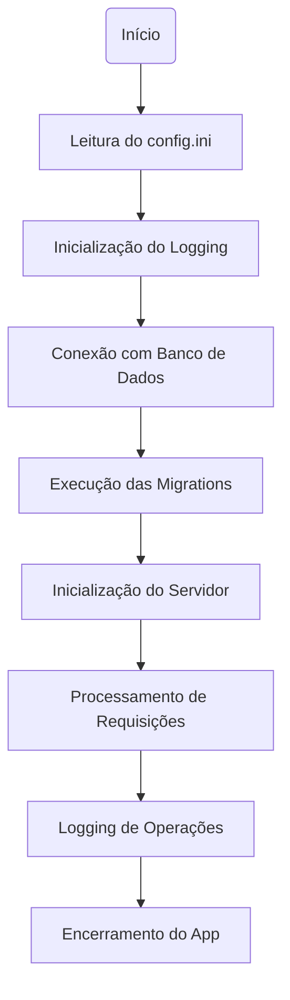

# Ciclo de Vida do App

Este documento descreve o ciclo de vida completo do framework FWE, desde a inicialização até o encerramento, destacando pontos importantes, dicas e exemplos de uso.

---

## 1. Inicialização do App

- O app é iniciado via `npm start` ou pelo Electron.
- O arquivo principal (`main.js` ou `server.js`) é executado.
- O sistema verifica e cria (se necessário) o arquivo `config.ini` no diretório do usuário.
- O config é lido e carregado em memória, tornando as configurações disponíveis globalmente.

**Dica:**
> Sempre revise o `config.ini` antes de rodar em produção.

---

## 2. Configuração e Logging

- O sistema de logging é inicializado conforme as opções do `config.ini`.
- Logs podem ser exibidos no console e/ou salvos em arquivos, conforme configuração.
- O logging já está disponível para todos os controllers e helpers.

**Exemplo:**
```js
Log.info('Aplicação iniciada');
```

---

## 3. Inicialização do Banco de Dados

- O tipo de banco (SQLite ou MySQL) é detectado automaticamente pelo config.
- O sistema conecta ao banco e, se necessário, cria o arquivo do banco SQLite.
- Se houver erro de conexão, o app não prossegue.

**Dica:**
> Sempre verifique as permissões do arquivo do banco e as credenciais do MySQL.

---

## 4. Execução das Migrations

- Ao iniciar, o sistema pode rodar as migrations para garantir que todas as tabelas estejam criadas.
- As migrations são aplicadas em ordem numérica crescente.
- Existem subpastas para MySQL e SQLite, garantindo compatibilidade.

**Exemplo de migration:**
```sql
CREATE TABLE IF NOT EXISTS event (
  id INTEGER PRIMARY KEY AUTOINCREMENT,
  name VARCHAR(100)
);
```

---

## 5. Inicialização do Servidor

- O servidor Express é iniciado na porta configurada (padrão: 9000).
- As rotas são carregadas a partir dos controllers e do arquivo de rotas.
- Middlewares globais (como autenticação) são aplicados conforme configuração.

**Dica:**
> Use o recurso de autostart no config.ini para iniciar o servidor automaticamente com o app.

---

## 6. Ciclo de Requisição

- O usuário faz uma requisição HTTP para a API.
- O Express roteia a requisição para o controller correspondente.
- O controller pode:
  - Validar os dados recebidos usando um Validator
  - Interagir com o Model para acessar o banco
  - Registrar logs de operação ou erro
  - Retornar resposta padronizada usando o helper Response

**Exemplo de resposta:**
```json
{
  "status": true,
  "message": "Evento criado com sucesso.",
  "data": { "id": 1 }
}
```

---

## 7. Logging e Monitoramento

- Todas as operações importantes são logadas automaticamente.
- Logs de erro, warning e info são separados.
- É possível limpar logs antigos automaticamente.

**Dica:**
> Monitore os arquivos de log para identificar padrões de erro ou uso.

---

## 8. Encerramento do App

- Ao fechar o app, o servidor Express é encerrado.
- A conexão com o banco é fechada.
- O sistema pode registrar um log de shutdown.

**Exemplo:**
```js
Log.info('Aplicação encerrada');
```

---

## Boas Práticas e Dicas Gerais

- Sempre use validators antes de gravar dados no banco.
- Use logs para registrar operações críticas e erros.
- Mantenha o `config.ini` seguro e faça backup.
- Crie migrations para toda alteração de estrutura no banco.
- Separe controllers, models e validators para manter o código organizado.
- Consulte os arquivos de exemplo e os manuais em `docs/` para dúvidas.

---

## Fluxo Resumido



---

Mantenha sempre o padrão e consulte este guia para garantir um ciclo de vida saudável e previsível para sua aplicação! 